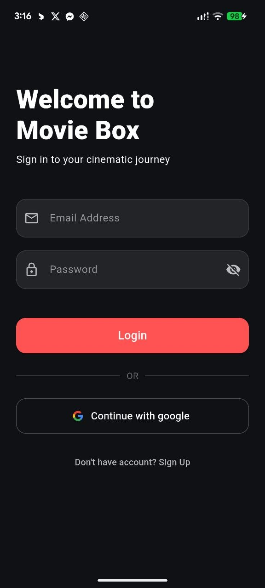
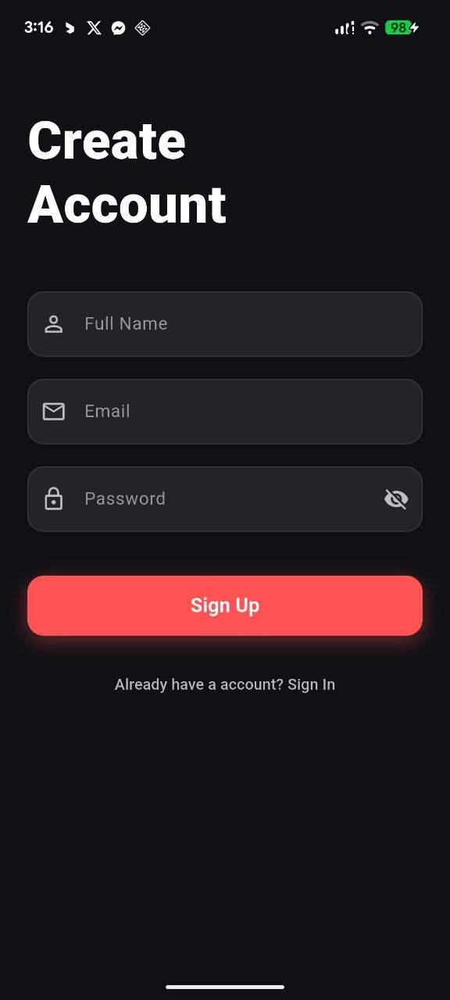
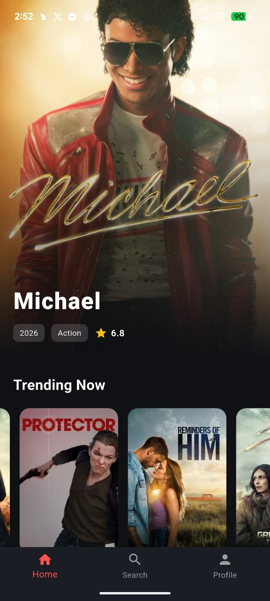
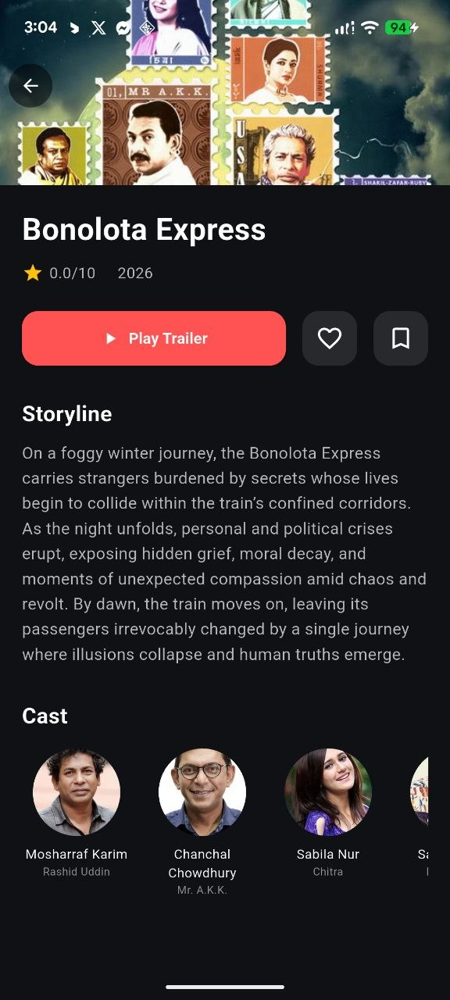
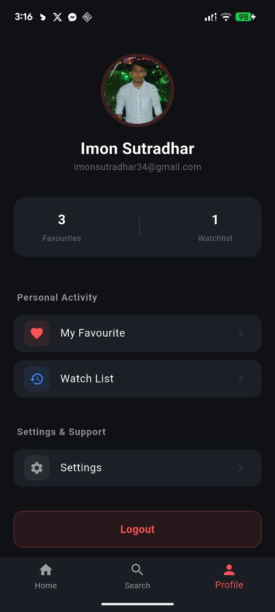
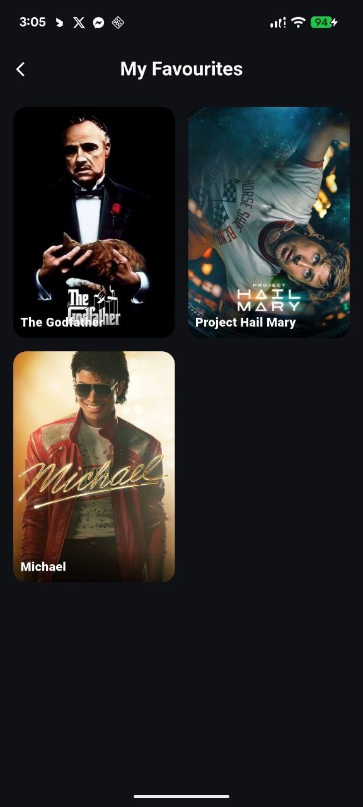

# 🎬 Movie Box

**Movie Box** is a premium movie discovery and tracking application built with **Flutter** and **Firebase**. It offers a seamless cinematic experience, allowing users to explore trending content, watch trailers, and manage personal collections with real-time cloud synchronization.

---

## 🚀 Key Features

### 🔐 Secure User Authentication
- **Email Verification Flow:** A robust security layer requiring users to verify their email before gaining access to the app.
- **Login/Signup:** Personalized accounts with secure password handling.
- **Google Sign-In:** One-tap authentication for a frictionless user experience.

### 🔍 Advanced Discovery
- **Live Search:** Instant search functionality to find any movie from the massive TMDB database.
- **Category & Genre Filtering:** Dynamic filtering logic (Action, Drama, Comedy, etc.) to help users browse specific niches.
- **Trending Now:** A curated feed of the most popular movies currently globally.

### 🎥 Multimedia & Details
- **Trailer Integration:** Built-in video player to watch official movie trailers without leaving the app.
- **Cast Information:** View the top 10 lead actors and their characters for every movie with horizontal scrolling.
- **In-depth Details:** View storylines, release years, and precise ratings for clarity).

### 📂 Personal Collections (Cloud Synced)
- **Favorites System:** "Heart" movies to save them to a dedicated Favorites list.
- **Watchlist / History:** A "Bookmark" feature to track movies you intend to watch.
- **Real-time Updates:** Powered by **Firebase Firestore** to ensure your data is synced across all devices instantly.

---
---

## 📸 App Screenshots

<p align="center">
  
  
</p>

<p align="center">
  
  
</p>

<p align="center">
  
  
</p>

<p align="center">
  
  
</p>

---


## 🛠️ Technical Stack

- **Frontend:** [Flutter](https://flutter.dev/) (Dart)
- **Backend:** [Firebase](https://firebase.google.com/)
  - **Auth:** Email/Password & Google Sign-In
  - **Database:** Cloud Firestore
- **Data Source:** [TMDB API](https://www.themoviedb.org/)
- **Logic Highlights:**
  - `FutureBuilder` & `StreamBuilder` for asynchronous data handling.
  - Custom `DatabaseService` for Firestore toggle logic.
  - Precise rating formatting using `toStringAsFixed(1)`.

---

## 📦 Project Structure

```text
lib/
├── models/       # Data models (MovieModel)
├── screens/      # UI Screens (Home, Login, Search, Details, etc.)
├── services/     # API, Firebase Auth, and Firestore logic
├── widgets/      # Reusable UI components (CustomInput, ActionButtons)
└── main.dart     # Application entry point

